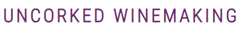

  

  

Uncorked winemaking is desigend for the newcomer to learn about brewing wine at home with some simple tools and equipment. I have been brewing my own wine for a number of years and found it to be a cheap and rewarding hobby. As Ireland is subjected to more and more stringent regulations around the sale of alcohol, now is a good time for the hobbyist to learn about it themselves and get started. I wanted the site to be somewhat minimalistic with clearly defined sections.

## UX
### Visitor Goals
The target audience for Uncorked Winemaking are:
* Newcomers looking for a new hobby.
* Enthusiasts looking for different recipes.
* People looking for a cheap solution.
* People who want full control of the ingredients.

Users are able to:
* Learn about the processes.
* Understand what steps are required.
* Learn about the equipment.
* Learn specific steps on some of my favourite recipes.
* Submit their own ideas.
* Subscribe to a mailing list.

### User Suggestions
1. I would like photos of the wine to be created.
2. I would like a full step by step guide.
3. I would like to see photos of some of the more specialised equipment.
4. I would like some tips to give it my own personal touch.
5. I would like to be able to submit my ideas.

## Design

### Fonts
Fonts were taken from google fonts. I used Roboto for the main font in the site and Roboto Condensed for the headers, as these fonts do compliment each other quite well making for an eyecatching and uniform reading experience.

### Icons

  

Icons were taken from fontawesome library and are styled with the utilised as classes in the css file. These are styled to match the colour theme of the site, with a hover subclass to match the colour of the site.

### Colour Scheme

  

I decided to go with a minimilistic approach with the colour scheme. I settled on a purple theme across the site to relate to a red wine. Menu bar, logo, horizontal lines, forms and instruction steps are all purple.  All text is black, with the exception of sub headings, menu links and locked footer.

### Styling
* Majority of images are inside a flexbox to make the image size adaptive to the screen size.
* Recipe pages have a jump link, with a border around the processes to grab attention.
* Purple horizontal lines to seperate content.
* Due to the length of the pages, footer is locked to the bottom of the screen and contains a link to the top of the page.
* Menu contains a drop down link that contains the list of wines available.
* Tips page contains a YouTube video that will scale with the screen size.
* Hero image consists of three images that will change, controlled by a media query, at 600px and 1200 px. Added a zoom using keyframes.
* Content will also narrow at 600px and 1200px to center the content, making it more readable for the end user.
* All external links will open in a new window.
* There are two forms on the site - subscribe and idea submission - and both are curved using border radius.

## Technologies Used
### Languages
* HTML
* CSS

### Libraries
* Google Fonts
* Fontawesome

## Testing
### Validation
* HTML tested with W3C HTML5 Validator every day.
* CSS has been validated with W3C CSS Validator every day or major change.

### Testing
* My site was sent to friends and family for feedback and testing.
* The hero-zoom animation has been tested on multiple devices.
* The forms are validated and will not submit with improper information.
* External links open in a new tab.
* As the site was built using a Windows 11 PC, majority of the testing was done on this machine in Chrome.
* Tested personally on a Windows 10 laptop with a smaller screen and my personal Android device.
* Tested personally in Chrome and Bing.
* Multiple Android and IOS devices used to test by family and friends.

### Bugs Found
* Video would initially not scale properly, attempted to fit it inside the same flexbox as the images, eventually corrected by creating new classes specifically for it.
* Drop down link was out of vertical alignment. I started with a button but eventually changed to a link which pushed it into alignment.
* Above correction caused the drop down menu to sit on top of the menu, this was corrected with a small margin on top.
* Above caused other unordeded lists to clash and display on top of one another, fixed by adding a new specific class for the menu.
* Slow connections can cause the images to load slowly, and look like the top of the page is mostly blank.

### Deployment
This site was deployed to GitHub pages. The steps to deploy are as follows:

1. Navigate to [https://github.com/Karl-Ryan0/Uncorked](https://github.com/Karl-Ryan0/Uncorked).
2. You can set up your own repository and copy or clone it, or you fork the repository.
3. `git add`, `git commit` and `git push` to a GitHub repository, if necessary.
4. GitHub pages will update from the master branch by default.
5. Go to the **Settings** page of the repository.
6. Scroll down to the **Github Pages** section.
7. Select the Master Branch as the source and **Confirm** the selection.
8. Wait a minute or two and it should be live for viewing.

Live link can be found [here](https://karl-ryan0.github.io/Uncorked/index.html).

## Credits
Some text content created using [chat.openai.com](https://chat.openai.com/) but the majority of content and instructions are freehand based on my own experiences and knowledge. Images were all created using the Photosonic section of [Writesonic](https://app.writesonic.com/). [favicon.io](https://favicon.io/) was used to create the favicon on the site.